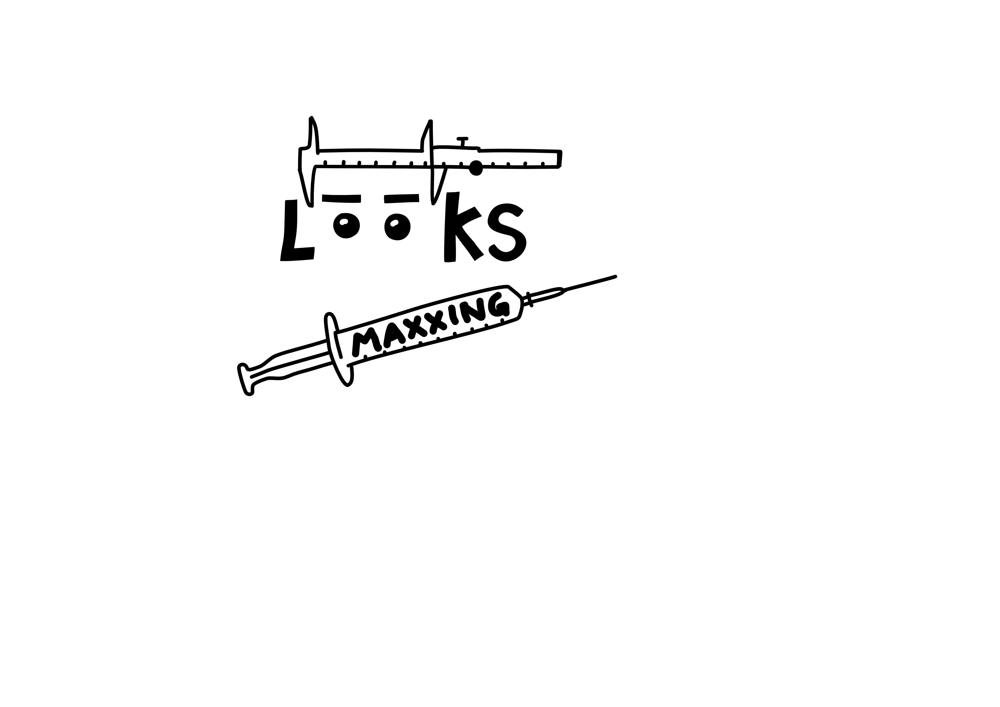

***The routine takes two hours. The supplements cost more than food. The goal is a score on a scale that does not officially exist.***

**Literal meaning:** **Looksmaxxing** describes the practice of systematically maximising physical attractiveness through any available means — skincare, fitness, surgery, dental work, posture correction, and increasingly procedures targeting bone structure such as jaw contouring and canthal tilt correction. At the extreme end: **bone smashing** — deliberately striking the jaw or cheekbones with a hammer, based on the misapplied premise that damaged bone rebuilds itself into a more "optimal" structure. The female equivalent is quieter but no less physical: high heels that permanently alter foot structure and gait; **mewing** — pressing the tongue against the palate for hours to allegedly reshape the jaw over time; extreme caloric restriction that disrupts hormonal systems. The bodily logic is the same: endure structural discomfort now, receive structural improvement later. The "-maxxing" suffix signals optimisation to a maximum: not improvement but maximisation. The practice applies to both men and women. Men are scored on a fixed hierarchy: **Subhuman**, Low Tier Normie, Mid Tier Normie, **Chad**, Adamlite, True Adam (10/10). Women are rated on a parallel scale — Becky, Stacy, Gigastacy — and are told to optimise their [[SMV (Sexual Market Value)|SMV]] through weight, skin, femininity, and style. The underlying logic is identical: attractiveness is a number, and that number can be raised. Below a four, regardless of gender: **Subhuman**. The vocabulary is the ideology.

**Origin:** The term emerged from **incel** and [[Manosphere]] forums in the early 2010s, where physical appearance was theorised as the primary determinant of sexual and social success. It spread into mainstream **TikTok** and **YouTube** culture from around 2022, generating a large content ecosystem from skincare routines to surgical bone contouring. Dutch research cited by De Volkskrant found that approximately half of Dutch 15-year-olds regularly encounter manosphere content — of which **looksmaxxing** is a direct product. Renaissance artist Albrecht Dürer mapped ideal human proportions in 1528 — but understood them as unreachable for mortals. Looksmaxxers have inverted that logic: the ideal is not only reachable, it is compulsory.

> The systematic optimisation of physical appearance as a measurable, scored project — where the body becomes a product to be maximised toward an externally defined, pseudoscientific standard.

**The Appeal:** **Looksmaxxing** offers agency in a domain where many people feel powerless. If attractiveness determines outcomes — socially, romantically, professionally — then optimising it is rational. For many participants it produces genuine confidence and practical self-care skills. Journalist **Bregje Hofstede** (De Correspondent, 2026) frames it precisely: **looksmaxxing** is not stupidity. It is a logical response to a culture that rewards only the measurable and visible — what she calls "metafysische precariteit": existential insecurity without intrinsic value to fall back on.

**The Friction:** The logic has no endpoint. [[SMV (Sexual Market Value)]] — attractiveness quantified as market position — is the framework: your score can always be higher. The hierarchy is explicit and merciless: looksmaxxers are unsparing about age, and "descension" is inevitable. Forum posts ask: "At what age is it over?" Answers range from 30 to 50. [[Blackpill]] is the terminus for those who conclude the project is futile — bone structure is destiny. [[Body Dysmorphic Disorder]] sits at the clinical end: increasing BDD presentations in men are now associated specifically with **looksmaxxing** content. [[Comparison Culture]] is the environment: the content produces constant upward comparison against algorithmically optimised faces. British philosopher **Iris Murdoch** argued in *The Sovereignty of Good* (1970) that reducing human value to the visible and measurable is a category error — morality and intrinsic worth cannot be quantified. **Looksmaxxing** is what happens when that argument loses. The political dimension is not incidental: whoever can promise the fundamentally insecure young man that he is "worth something" — regardless of his canthal tilt — holds enormous power. Marketers and populist politicians both know this.

**Why This Matters:** **Looksmaxxing** makes the body into a project with a never-ending to-do list. The word "**Subhuman**" — applied to anyone scoring below four — carries a history. Once you teach people to rank themselves and others on a hierarchy from valuable to worthless, that logic becomes available for application to entire groups. When extreme plastic surgery becomes a tribal marker — as in the so-called **"Mar-a-Lago face"**, the uniform aesthetic of heavily filled, surgically tightened faces associated with wealthy political circles — looksmaxxing becomes a geopolitical instrument. The optimised body signals class, allegiance, and access. What began as an individual optimisation project becomes a legible political identity worn on the face.

**See also:** [[SMV (Sexual Market Value)]] · [[Blackpill]] · [[Manosphere]] · [[Subhuman]] · [[Body Dysmorphic Disorder]] · [[Comparison Culture]]

---

**Read more:**
- [Looksmaxxing is het gevaarlijke antwoord op de vraag: ben ik iets waard?](https://decorrespondent.nl/16941/looksmaxxing-is-het-gevaarlijke-antwoord-op-de-vraag-ben-ik-iets-waard/7ba9fc8a-3dd5-0c35-1a9e-07fbae12e42d) — Hofstede, B. (22 mei 2026). *De Correspondent*
- [Sexual Market Value — The Power Moves](https://thepowermoves.com/sexual-market-value/) — *artifact*: een actieve SMV-instructiesite; illustreert hoe de looksmaxxing-ideologie online wordt onderwezen en genormaliseerd
- [From bone smashing to chin extensions: how 'looksmaxxing' is reshaping young men's faces](https://www.theguardian.com/lifeandstyle/2024/feb/15/from-bone-smashing-to-chin-extensions-how-looksmaxxing-is-reshaping-young-mens-faces) — Usborne, S. (2024). *The Guardian*
- [Alphas, Betas, and Incels](https://doi.org/10.1177/1097184x17706401) — Ging, D. (2019). *Men and Masculinities*
- [Looksmaxxing: Straddling the Inflection Between Self-Enhancement and Self-Harm](https://journals.sagepub.com/doi/10.1177/26893614251409793) — Konig, D.J., Sidhu, A.S., & Corpuz, G.S. (2025). *SAGE Open Medicine*
- [The Sovereignty of Good](https://www.routledge.com/The-Sovereignty-of-Good/Murdoch/p/book/9780415253994) — Murdoch, I. (1970). *Routledge*

> [!abstract]- Sources
> **[[Ging-2019|Ging (2019)]]** · *Alphas, Betas, and Incels* · Men and Masculinities · [DOI ↗](https://doi.org/10.1177/1097184x17706401)
> Academisch kader: SMV-logica als fundament van looksmaxxing; manosphere als ecosysteem van masculiniteitsideologieën.
>
> **[[Konig-2025|Konig et al. (2025)]]** · *Looksmaxxing: Self-Enhancement or Self-Harm?* · SAGE Open Medicine · [DOI ↗](https://journals.sagepub.com/doi/10.1177/26893614251409793)
> Klinische analyse: looksmaxxing op de grens tussen zelfverbetering en zelfschade; verbinding met BDD.
>
> **[[Secondary|Hofstede (2026) · Usborne (2024) · Murdoch (1970)]]** · [De Correspondent ↗](https://decorrespondent.nl/16941/looksmaxxing-is-het-gevaarlijke-antwoord-op-de-vraag-ben-ik-iets-waard/7ba9fc8a-3dd5-0c35-1a9e-07fbae12e42d) · [The Guardian ↗](https://www.theguardian.com/lifeandstyle/2024/feb/15/from-bone-smashing-to-chin-extensions-how-looksmaxxing-is-reshaping-young-mens-faces) · [Routledge ↗](https://www.routledge.com/The-Sovereignty-of-Good/Murdoch/p/book/9780415253994)
> Journalistiek + filosofisch achtergrondmateriaal — Nederlandse context, casussen, filosofisch tegenwicht.
>
> **[[Secondary|The Power Moves (z.j.)]]** · [The Power Moves ↗](https://thepowermoves.com/sexual-market-value/)
> Artifact — SMV als instructiesysteem in actieve circulatie: hoe de looksmaxxing-ideologie online wordt onderwezen en genormaliseerd.

---

**Navigation**

**Layer:** Mechanism — the systematic optimisation of appearance as a scored, pseudoscientific project

**Cause:** [[SMV (Sexual Market Value)]] · [[Manosphere]]
**Mechanism:** [[Comparison Culture]] · [[Blackpill]]
**Consequence:** [[Body Dysmorphic Disorder]] · [[Blackpill]] · [[Subhuman]]
**Reaction:** [[Deinfluencing]]

Created with AI assistance (Claude, ChatGPT, Lumo) using cartographic prompting — a research method developed within Project Digitale Alertheid, HAN CMD, 2026.

