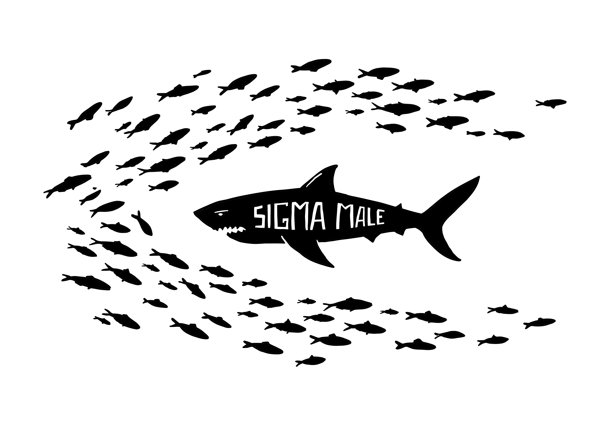

***He does not need the hierarchy. He is above it. He is also extremely online.***

**Literal meaning:** The **sigma male** is a concept in **manosphere** hierarchy discourse describing a man who operates outside the alpha/beta dominance hierarchy — a lone wolf who achieves success on his own terms, without competing for social approval. The sigma is presented as equal or superior to the alpha, but unconstrained by the need for validation.

**Origin:** The term was coined in a blog post around 2010 and gained viral traction through meme culture from around 2021, where "**sigma male** grindset" became a widespread ironic (and then earnest) format. The concept drew on popular psychology frameworks around introversion and independence, filtered through **manosphere** hierarchy logic.

<small>*By Narrative Typographer Anne-Marie Bruinsma*</small>

> A masculinity archetype that claims to transcend social hierarchy while remaining entirely defined by it — the loner who is above the game he is still playing.

**The Appeal:** The sigma framework offers status to men who do not or cannot compete in conventional social hierarchies. Rather than being a beta who lost, you are a sigma who chose not to play. It provides the same status validation as alpha identity — indeed, higher status — without requiring social competition. For introverted, isolated, or socially anxious men, it reframes their situation as chosen superiority rather than involuntary exclusion. Analysis of sigma content on TikTok ([[Tanner-Gillardin-2025|Tanner & Gillardin, 2025]]) confirms this appeal functions as a "ready-to-think" framework, offering a pre-packaged response to a perceived crisis of masculinity.

**The Friction:** The paradox is structural: **sigma male** is a status category for people who claim not to care about status. The claim to transcend the hierarchy is itself a hierarchy position — which means the hierarchy is not transcended at all. [[SMV (Sexual Market Value)]] — the underlying market logic — continues to operate: the sigma's value is simply measured differently. [[Alpha Male]] is the hierarchy being claimed to transcend; [[MGTOW]] — men going their own way — is a more committed version of the withdrawal logic. [[NPC]] — non-player character, people on autopilot — is the complementary concept: the sigma is the main character surrounded by NPCs. Both concepts locate superiority in refusal to participate in systems the speaker simultaneously requires for self-definition. [[Body Dysmorphic Disorder]] is not sigma's own outcome — the identity is psychological, not a body project — but it sits in the same network as the clinical register the same SMV logic takes on [[Looksmaxxing]]'s harder, more literal path.

**Why This Matters:** **Sigma male** makes visible how status hierarchies generate their own apparent escape routes — which turn out to be additional rungs on the same ladder. The critique of the hierarchy becomes a position within it.

**Related terms:** [[Alpha Male]] · [[SMV (Sexual Market Value)]] · [[MGTOW]] · [[NPC]] · [[Manosphere]] · [[Tradwife]] · [[Looksmaxxing]] · [[Body Dysmorphic Disorder]]

---

**Further reading:**

*Primary:*
- [[Ging-SigmaMale-2019|Ging, D. (2019)]] — [Alphas, Betas, and Incels](https://doi.org/10.1177/1097184x17706401). *Men and Masculinities*
- [[Tanner-Gillardin-2025|Tanner & Gillardin (2025)]] — [Toxic Communication on TikTok](https://doi.org/10.1177/20563051251313844). *Social Media + Society*
- [[Watson-2021|Watson (2021)]] — *The Sigma Male Bible* *(artifact)*

*Secondary:*
- [[Secondary-SigmaMale|Dictionary.com (2023) · Newswise (2025)]] — lexicografisch + journalistiek

Created with AI assistance (Claude, ChatGPT, Lumo) using cartographic prompting — a research method developed within Project Digitale Alertheid, HAN CMD, 2026.

