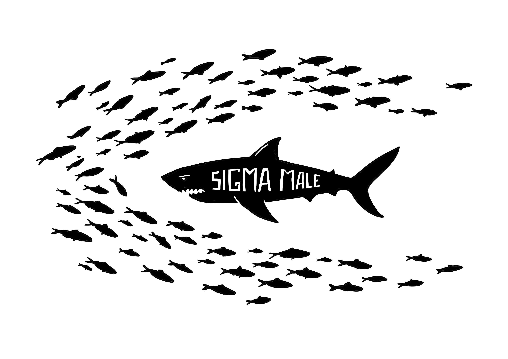

***He does not need the hierarchy. He is above it. He is also extremely online.***

**Literal meaning:** The **sigma male** is the [[Manosphere|manosphere]]'s name for a man who stands outside the alpha/beta hierarchy: a lone wolf who succeeds on his own terms and needs no one's approval. *Sigma* is one more letter from the Greek alphabet the manosphere ranks men with: after alpha and beta, a letter for the man who claims the ranking does not apply to him.

**Origin:** The term first appeared in a blog post by the American writer Vox Day and spread through memes. It went viral in 2021, and in 2023 #sigma had more than 46 billion views on TikTok, much of it ironic ([[Secondary-SigmaMale|Wikipedia]]).

<small>*By Narrative Typographer Anne-Marie Bruinsma*</small>

> A masculinity archetype that claims to transcend social hierarchy while remaining entirely defined by it — the loner who is above the game he is still playing.

**The Appeal:** The sigma offers status to men who do not or cannot compete in the usual hierarchies: not a beta who lost, but a sigma who chose not to play. For introverted, isolated or anxious men it turns exclusion into chosen superiority. Sigma content on TikTok works as a "ready-to-think" framework, a ready-made answer to a perceived crisis of masculinity ([[Tanner-SigmaMale-2025|Tanner & Gillardin, 2025]]), and on X, [[Diallo-SigmaMale-2025|Diallo et al. (2025)]] describe a global counterculture of personal development for men that offers "complete acceptance and understanding of male-only struggles".

**The Friction:** The paradox is structural: a status category for people who claim not to care about status. [[SMV (Sexual Market Value)]] still runs underneath; [[Alpha Male]] is the hierarchy it claims to leave, and [[MGTOW]] the more committed withdrawal. [[NPC]] is its counterpart: the sigma as the one conscious man among people on autopilot. Diallo et al. found the community building "alternative truths" as an escape for men dissatisfied with their lives, on a platform with few rules against provocative speech.

**Why This Matters:** **Sigma male** makes visible how a status hierarchy produces its own escape routes, which turn out to be further rungs on the same ladder.

**Related terms:** [[Alpha Male]] · [[SMV (Sexual Market Value)]] · [[MGTOW]] · [[NPC]] · [[Manosphere]] · [[Tradwife]] · [[Looksmaxxing]] · [[Body Dysmorphic Disorder]]

---

**Read more:**

*Primary:*
- [[Tanner-SigmaMale-2025|Tanner & Gillardin (2025)]] — [Toxic Communication on TikTok](https://doi.org/10.1177/20563051251313844). *Social Media + Society*
- [[Diallo-SigmaMale-2025|Diallo, Le, Holzer & Popova (2025)]] — [Online conversations between "real men": A reflexive thematic analysis of sigma male discourse on Twitter](https://doi.org/10.5210/fm.v30i3.13648). *First Monday*

*Secondary:*
- [[Secondary-SigmaMale|Dictionary.com (2023) · Newswise (2025) · Watson (2021) · Wikipedia · Ging (2019)]] — lexicography, journalism, a self-help artefact (*The Sigma Male Bible*), and theory

Created with AI assistance (Claude, ChatGPT, Lumo) using cartographic prompting — a research method developed within Project Digitale Alertheid, HAN CMD, 2026.

