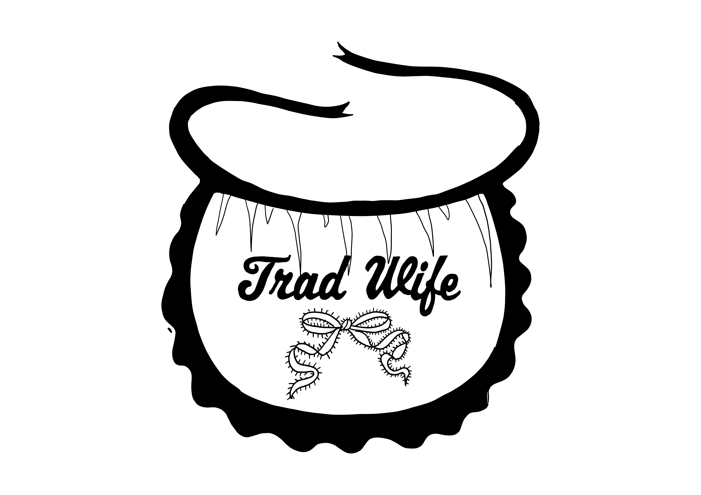

***She bakes bread, raises children, defers to her husband — and films all of it for an audience of millions.***

**Literal meaning:** **Tradwife** — from *traditional wife* — describes women who publicly embrace and promote a domestic, homemaking role as their primary identity: cooking, cleaning, child-rearing, and deference to a male **provider**, presented as a deliberate, values-driven lifestyle choice rather than economic necessity. Most tradwives are also influencers: content creators who document and monetise this domestic life through YouTube, TikTok, and Instagram — reaching audiences of hundreds of thousands to millions. The aesthetic is curated, the lighting is soft, and the platform is a business.

**Origin:** The term entered online discourse around 2018–2019, associated with accounts on Instagram, YouTube, and later TikTok that presented aestheticised domesticity as a counter-cultural statement against feminist career culture. Researchers including Annie Kelly and Adrienne Russell have documented how tradwife content draws simultaneously on nostalgic aesthetics, [[Purity Culture|Christian traditionalism]], and white nationalist ideology — with varying degrees of explicitness across different accounts. The same [[SMV (Sexual Market Value)|SMV logic]] that structures [[Manosphere]] content for men operates here: the tradwife optimises her femininity, domesticity, and deference to maximise her value as a mate — the female route through the same market logic that drives [[Looksmaxxing]]. Ging (2019) documents how this ideological ecosystem produces mutually reinforcing content categories across gender lines.

<small>*By Narrative Typographer Marieke de Vogel*</small>

> Domestic femininity performed as aspirational content — where the rejection of professional identity is distributed as a lifestyle brand.

**The Appeal:** **Tradwife** content offers a coherent alternative to the "have it all" narrative that many women experience as exhausting and unachievable. The aesthetic is beautiful, the domestic scenes are calm, and the message — that homemaking is valuable and dignified — addresses a genuine cultural dismissal of domestic labour. For women who prefer or need a domestic role, the framework provides identity and community. Betz, Liss & Ramsey (2026) identify three conditions that made tradwife content flourish: frustration with feminism's incomplete revolution on domestic labour, COVID-19 nostalgia for domestic life, and alignment with far-right political communications that validate gender essentialism.

**The Friction:** The paradox is structural. [[Highlight Reel]] — showing only the best — is the format: the **tradwife**'s content is carefully produced, lit, and edited. The brand is funded by the platform economy the **tradwife** appears to reject. [[Provider]] — the male caretaker role as transaction — is the complementary framework: **tradwife** and provider are a paired set within SMV logic. Researcher Annie Kelly (2018) has documented the ideological spectrum: the same aesthetic runs from benign domestic preference to explicitly white nationalist "white baby fever" content. Betz et al. (2026) note that this "return to tradition" is only accessible to economically privileged women — and carries white supremacist ideology and anti-transgender sentiment through the same nostalgic imagery. [[Purity Culture]] provides the ideological architecture: the clean body, the pure household, the uncorrupted femininity — the same contamination logic that runs from religious purity to nationalist demographics runs through the aesthetic of the tradwife kitchen. The platform recommendation system does not distinguish between them, and the migration between them is documented.

**Why This Matters:** **Tradwife** makes visible the contradiction between form and content — a rejection of modern values distributed through the most modern available infrastructure. The influencer who monetises submission is also the entrepreneur who built a brand. Once you see the platform economy behind the aesthetic, the "return to tradition" is legible as a content category.

**See also:** [[Provider]] · [[SMV (Sexual Market Value)]] · [[Womanosphere]] · [[Manosphere]] · [[Highlight Reel]] · [[Stay-at-home Girlfriend (SAHG)]] · [[Purity Culture]] · [[Looksmaxxing]]

---

**Read more:**
- [Not the Solution We Proposed](https://journals.sagepub.com/doi/10.1177/03616843261442440) — Betz, D.E., Liss, M., & Ramsey, L.R. (2026). *Psychology of Women Quarterly*
- [The Housewives of White Supremacy](https://www.johnlocke.org/the-housewives-of-white-supremacy/) — Kelly, A. (2018). *New York Times*
- [Alphas, Betas, and Incels](https://doi.org/10.1177/1097184x17706401) — Ging, D. (2019). *Men and Masculinities*
- [With the demands of modern life, some women are drawn to the 'tradwives' movement](https://www.uva.nl/en/shared-content/faculteiten/en/faculteit-der-maatschappij-en-gedragswetenschappen/news/2024/07/tradwives.html) — Universiteit van Amsterdam (2024)
- [What Is a 'Tradwife' and How Does It Differ from Stay-at-Home Moms?](https://www.parents.com/tradwife-meaning-and-why-its-controversial-8656603) — *Parents* magazine (2024)
- [The Real Problem With Tradwives](https://www.vogue.com/article/problem-with-tradwives) — *Vogue* (2024)

> [!abstract]- Sources
> **[[Betz-2026|Betz, Liss & Ramsey (2026)]]** · *Not the Solution We Proposed* · Psychology of Women Quarterly · [DOI ↗](https://journals.sagepub.com/doi/10.1177/03616843261442440)
> Feminist psychologisch kader: drie enabling conditions van de tradwife-beweging; white supremacist ideology en anti-trans sentiment als onderstroom; 'return to tradition' alleen toegankelijk voor geprivilegieerde vrouwen.
>
> **[[Ging-2019|Ging (2019)]]** · *Alphas, Betas, and Incels* · Men and Masculinities · [DOI ↗](https://doi.org/10.1177/1097184x17706401)
> Manosphere als ecosysteem: SMV-logica als organiserend principe voor zowel mannelijke als vrouwelijke content-categorieën — tradwife als spiegelterm.
>
> **[[Secondary|Kelly (2018) · UvA (2024) · Vogue (2024) · Parents (2024)]]** · [NYT ↗](https://www.johnlocke.org/the-housewives-of-white-supremacy/) · [UvA ↗](https://www.uva.nl/en/shared-content/faculteiten/en/faculteit-der-maatschappij-en-gedragswetenschappen/news/2024/07/tradwives.html) · [Vogue ↗](https://www.vogue.com/article/problem-with-tradwives) · [Parents ↗](https://www.parents.com/tradwife-meaning-and-why-its-controversial-8656603)
> Journalistiek + beschouwend — ideologisch spectrum van de beweging, maatschappelijke context, publieke duiding.

---

**Navigation**

**Layer:** Mechanism — the performance of domesticity as identity, brand, and ideological position

**Cause:** [[SMV (Sexual Market Value)]] · [[Womanosphere]] · [[Manosphere]] · [[Purity Culture]]
**Mechanism:** [[Provider]] · [[Highlight Reel]] · [[Looksmaxxing]]
**Consequence:** [[Comparison Culture]] · [[Stay-at-home Girlfriend (SAHG)]]
**Reaction:** [[Deinfluencing]]

Created with AI assistance (Claude, ChatGPT, Lumo) using cartographic prompting — a research method developed within Project Digitale Alertheid, HAN CMD, 2026.

